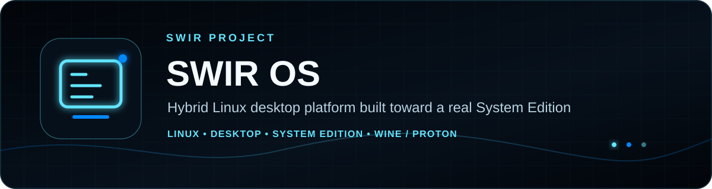

<!-- SWIR-README-STANDARD:v2 -->

<div align="center">



<br>

[](https://github.com/Swir/SWIR_OS/actions/workflows/system-contracts.yml)
[](https://github.com/Swir/SWIR_OS/actions/workflows/system-live-usb-install-vm-e2e.yml)
[](https://github.com/Swir/SWIR_OS/actions/workflows/system-graphical-installer-contract.yml)
[](https://github.com/Swir/SWIR_OS/actions/workflows/desktop-windows-build.yml)
[](https://github.com/Swir/SWIR_OS/actions/workflows/roadmap-contract.yml)


[](https://github.com/Swir)
[](https://github.com/Swir/SWIR_OS/stargazers)

<br>

[**Status**](#-project-status) · [**Highlights**](#-highlights) · [**Web**](#️-quick-start--web-edition) · [**System**](#-system-edition--live-usb--installation) · [**Roadmap**](#️-roadmap--releases)

**Canonical source repository:** `Swir/SWIR_OS`

</div>


## 📊 Project status

SWIR OS is actively being developed as three connected editions: a browser-based Web Edition, a Windows Desktop Edition with native adapters, and a real Linux-native System Edition intended to run from removable media and install to disk as a standalone operating system.

| Edition | Current state | Version / status |
|---|---|---|
| **Web Edition** | Portable shell, applications and API laboratory | `1.7.13` |
| **Desktop Edition** | Windows host with native OS adapters and guarded update/recovery foundations | `0.5.7-preview` |
| **System Edition** | Debian 13 foundation with VM-verified UEFI Live USB → guarded disk install → source-USB-detached installed boot; native GTK4 installer integration in progress | In development |

### Overall roadmap

```text
███████████████░░░░░ 75.4%
```

**49 of 65 measurable roadmap deliverables are complete.** The total increased because Live USB, disk installation, detached boot, graphical-installer E2E and physical-hardware qualification are now tracked explicitly rather than hidden inside a generic bootable-image milestone. The authoritative checklist and progress math live in [`SWIR-OS-ARCHITECTURE.md`](SWIR-OS-ARCHITECTURE.md). A prototype, contract skeleton or CI job alone does not count as a completed roadmap item.

---

## 🚀 What is SWIR OS?

SWIR OS is designed as a hybrid desktop platform with one shared application/service model and edition-specific native implementations. It is not intended to remain a themed browser desktop.

The target System Edition uses a maintained Linux base and keeps Linux-native hardware support first:

```text
Linux kernel / Debian 13 base
        │
        ├── SWIR boot + authenticated session layer
        ├── native SWIR desktop shell and applications
        ├── NetworkManager + native system services
        ├── SWIR Store / Package Provider layer
        ├── Hardware Service + Driver Center
        ├── Live USB + native installer
        └── recovery / rollback services

Linux applications   -> native Linux execution
Windows applications -> managed Wine / Proton compatibility profiles
```

Windows kernel drivers are **not** treated as a general solution for Linux hardware. SWIR OS prefers kernel in-tree drivers, `linux-firmware`, selected distribution repositories, `fwupd`/LVFS where supported, and explicit official vendor repositories for exceptional proprietary components.

---

## ✨ Highlights

| Area | Verified/current direction |
|---|---|
| 💽 **Live USB & installation** | A raw GPT amd64 image with SHA-256 is booted in CI as real QEMU USB mass storage under UEFI/OVMF. The VM gate proves graphical Live boot, no target write during idle/preview/cancel/wrong-token paths, source-media rejection, guarded install to a separate blank disk, source USB removal, standalone installed-disk boot and persistence. Physical USB qualification is still open. |
| 🧭 **Native installer** | A GTK4 installer with SWIR styling is being integrated into the final Live image. It uses read-only target preview, stable `/dev/disk/by-id` identities, exact erase-token review, account/locale/keyboard/time-zone collection and a narrow Polkit helper. A real GTK window is smoke-tested; the full destructive UI-driven E2E remains open. |
| 🐧 **Linux System foundation** | Debian 13 base, kernel, UEFI boot path, systemd and authenticated graphical-session foundations are covered by System Edition gates. |
| 🖥️ **Desktop bridge** | Windows Desktop Host exposes native filesystem, app-data, account/session, process/service, device/network, clipboard, tray, shortcuts, file-association and notification adapters. |
| 🍷 **Windows compatibility** | Managed Wine compatibility has a live E2E that launches a deterministic Win64 application through controlled per-app compatibility state. Broader application compatibility is still being expanded. |
| 📦 **Packages** | The Debian 13 System package path verifies the production distribution provider, read-only APT dependency resolution, real journaled APT installation and fail-closed interrupted-transaction reconciliation. Flatpak/AppImage remain explicit experimental adapters. |
| 🛟 **Recovery** | A dedicated UEFI recovery entry boots a hardened SWIR recovery target with `SWIR_ROOT` read-only, normal fstab automounting disabled, no guest NIC and no automatic filesystem/package/firmware mutation. |
| 🔧 **Hardware & drivers** | PCI/USB inventory, Hardware Catalog, Driver Center runtime, Linux in-tree drivers and `linux-firmware` are verified foundations. Supported Driver Center package/fwupd mutation routes add a private parent journal; direct kernel-module mutation remains disabled. |
| 🌐 **Networking** | NetworkManager integration is exercised through a real isolated live E2E path. |
| 🔐 **Security** | Privileged operations are designed around explicit brokers, Polkit/session identity binding, trusted repository policy, journals and fail-closed validation. |
| 🌍 **i18n** | Shared BCP-47 locale architecture, English fallback, RTL/LTR handling and bundled core locale packs are maintained across the project. |

---

## 🧠 Architecture

SWIR OS shares contracts where that improves portability, while replacing browser-only implementations with native adapters as the project moves toward System Edition.

```text
                    SWIR contracts / package metadata
                               │
              ┌────────────────┼────────────────┐
              │                │                │
              ▼                ▼                ▼
        Web Edition      Desktop Edition   System Edition
        Browser/PWA      Windows host      Native Linux
        prototype UI     native brokers    shell + services
        IndexedDB        native adapters   Linux services
                                              │
                              ┌───────────────┴───────────────┐
                              ▼                               ▼
                    Native Linux apps                 Windows apps
                                                     Wine / Proton
```

Portable contracts may be reused across editions, but essential System Edition functionality must not depend on a browser runtime.

### System Edition application policy

Core daily-use applications must become native Linux desktop applications. The minimum product baseline includes File Manager, Settings, Terminal, Software/Store, Update Center, Hardware & Driver Center, Network Center, SWIR Browser, Notes/Text Editor, SWIR Player, SWIR Photo Studio/Image Viewer, PDF Viewer, Archive Manager, Calculator, Screenshot Tool, Task Manager/System Monitor, diagnostics and backup/recovery entry points.

See [`SWIR-PRODUCT-BASELINE-1.0.md`](SWIR-PRODUCT-BASELINE-1.0.md) for the mandatory end-user baseline.

---

## 💽 System Edition — Live USB & installation

The required System Edition path is:

```text
build verified image + SHA-256
        ↓
write image to removable media
        ↓
firmware boots SWIR Live
        ↓
try the graphical session without automatic internal-disk writes
        ↓
review exact target + partition plan
        ↓
explicit target-bound destructive confirmation
        ↓
install SWIR OS to SSD / NVMe / HDD
        ↓
remove source USB
        ↓
boot installed SWIR OS with persistent data
```

The repository now verifies this path in a **disposable UEFI VM** using the final raw image as QEMU USB mass storage and a second blank virtual disk. This is meaningful boot/install evidence, but it is not a claim that every physical PC works. Secure Boot, legacy BIOS and broad physical-hardware qualification remain unverified.

The image builder writes a SHA-256 sidecar. There is **no public System Edition download/release yet**, so this README does not provide a fake end-user download command. The current image and installer paths are development/CI foundations until the remaining graphical-installer and physical-hardware gates are passed.

The native GTK4 installer is documented in [`system/SWIR-GRAPHICAL-INSTALLER-0.1.md`](system/SWIR-GRAPHICAL-INSTALLER-0.1.md), while the current removable-media/install E2E is documented in [`system/SWIR-LIVE-USB-INSTALL-0.1.md`](system/SWIR-LIVE-USB-INSTALL-0.1.md).

---

## 📦 Software and package model

System Edition keeps software sources behind a common provider boundary instead of allowing Store UI to execute arbitrary package-manager commands.

```text
SWIR package metadata
        │
        ├── distribution packages  -> production provider + dependency-aware APT path verified
        ├── Flatpak                -> experimental / later production gate
        ├── AppImage               -> experimental / later production gate
        ├── Wine compatibility profiles
        └── Proton compatibility profiles
```

Distribution package plans require trusted source metadata, signature verification, a structured operation plan and privileged transaction boundaries. Before an APT mutation, the System stack runs a read-only `apt-get -s` dependency simulation and binds the resolved dependency closure into the exact plan digest that enters the durable journal. A disposable Debian 13 image E2E performs a real journaled installation, verifies the package was absent before mutation, checks the committed owner-only journal and verifies the installed native entry point. Dependency-aware update/remove planning is also exercised.

Interrupted APT transactions have a verified fail-closed recovery path: recovery re-authorizes the original plan digest, reconciles the live package state with dpkg/APT consistency and native health, records the recovery outcome, and does not perform an automatic inverse package mutation. Driver Center package/fwupd mutations have a verified parent journal that binds the exact selected preview operation to the existing child transaction journal. The coordinator does not invent rollback, direct kernel-module mutation or automatic retries when the child service cannot prove them safely.

Flatpak/AppImage stay deliberately gated until their production lifecycle, rollback/update policy and System-image integration satisfy their own requirements.

Microsoft Store is not copied, impersonated or bypassed. Any future integration would require an official Microsoft-supported and licensable path.

---

## 🔧 Hardware & Driver Center

The hardware architecture is **read-only first**. Hardware Service normalizes PCI/USB identities and maps known devices through Hardware Catalog data to modules, firmware, packages and trusted update sources.

Allowed driver/firmware source classes are limited to:

- Linux kernel in-tree drivers,
- `linux-firmware`,
- selected signed distribution repositories,
- `fwupd` / LVFS where supported,
- allowlisted official vendor repositories for exceptional proprietary components.

Unknown hardware may be diagnosed, but it must not trigger arbitrary binary downloads. Supported Driver Center package/fwupd mutation routes are journaled and delegate to the existing guarded package or firmware child transaction service; direct module mutation remains review-only and unsupported by the mutation coordinator.

---

## 🔐 Security model

Security-sensitive paths are designed to fail closed. Current foundations include:

- closed permission/provider allowlists,
- owner/session-bound capability checks,
- Polkit-based privileged authorization boundaries,
- target-bound install confirmation tokens and source-media rejection,
- stable `/dev/disk/by-id` installer target policy,
- Ed25519 signed catalog verification foundations,
- SHA-256 payload validation,
- anti-rollback catalog sequencing,
- transactional package/update/Driver Center mutation journals,
- guarded Desktop update activation with health proof and rollback,
- pinned WebView2 runtime acquisition metadata and integrity checks,
- root-owned repository/driver policy for System Edition,
- no random driver-download path,
- no generic privileged shell path in the graphical installer helper.

Production package signing remains a roadmap item until the official production trust root and protected release-key provisioning are deployed and verified. Production private signing keys must never be stored in this repository.

---

## 🌍 Language architecture

SWIR OS is designed for multilingual use from the shared runtime upward:

- system/device locale detection,
- English fallback for unsupported locales,
- BCP-47 language/region matching,
- LTR/RTL direction propagation,
- locale-aware formatting foundations,
- bundled core locale packs currently covering 15 locales,
- localized First Boot/OOBE and critical application surfaces,
- offline availability of core locale resources.

The current installer UI has an intentionally limited first locale/keyboard/time-zone selection set; the full shared i18n baseline remains a separate product requirement.

Repository documentation and development files are maintained in English.

---

## ▶️ Quick Start — Web Edition

The Web Edition remains a real supported development edition for portable UI/API work. It is **not** the final System Edition runtime.

```bash
git clone https://github.com/Swir/SWIR_OS.git
cd SWIR_OS
python -m http.server 8000
```

Open `http://localhost:8000`.

---

## 🪟 Build — Windows Desktop Host

### Developer requirements

- Windows 10 or Windows 11 x64,
- .NET 8 SDK,
- network access only when the packaging script must obtain the repository-pinned Microsoft WebView2 Fixed Version Runtime.

These are developer/build-machine requirements. The release packaging path is designed to bundle the required runtime components for the end user.

```powershell
cd desktop/windows
dotnet build SWIR.Desktop.Host.csproj -c Release
```

Self-contained preview publish:

```powershell
./publish-desktop-host.ps1 `
  -PublishDir ./publish `
  -ReleaseVersion 0.5.7 `
  -Channel preview
```

A local build is not equivalent to an official verified release. Release pipelines add package/catalog, runtime provenance, signing/trust and update-chain verification.

---

## 📁 Repository structure

| Path | Purpose |
|---|---|
| `desktop/windows/` | Windows Desktop Host, native brokers, updater, packaging and self-tests |
| `system/installer/` | Guarded install engine, native GTK4 Live installer and narrow privileged helper |
| `system/e2e/` | Disposable System Edition boot/runtime/install verification |
| `system/image/` | Debian rootfs and bootable-media builders/evidence validators |
| `system/` | System services, package/runtime, hardware/driver, recovery and architecture foundations |
| `updates/` | Repository-owned Desktop update-channel metadata; binaries belong in immutable GitHub Releases |
| `scripts/` | Package, catalog, roadmap, trust-chain and release validators |
| `.github/workflows/` | Desktop/System/security/package/i18n CI gates |
| `SWIR-OS-ARCHITECTURE.md` | Canonical measurable roadmap and architecture |
| `SWIR-PRODUCT-BASELINE-1.0.md` | Mandatory daily-use product baseline |
| `SWIR-ROADMAP-STANDARD.md` | Locked roadmap dashboard format |
| `assets/branding/` | SWIR OS visual identity assets |

`Swir/SWIR_OS` is the authoritative development repository. `Swir/swir.github.io` is presentation/status only and is not an operating-system source/update authority.

---

## 🗺️ Roadmap & releases

Development currently prioritizes the highest-impact path to a dependable Desktop/System platform:

1. finish the native graphical Live installer and make its complete disposable-disk path E2E-verifiable,
2. build the native SWIR desktop shell and mandatory native application suite,
3. harden the Desktop host/update/signing lifecycle,
4. verify fwupd/LVFS mutation on supported hardware and controlled official-vendor repository policy,
5. qualify physical Live USB boot/install, recovery, full-system i18n, reliability and accessibility without inflating VM evidence into hardware claims.

The authoritative roadmap is [`SWIR-OS-ARCHITECTURE.md`](SWIR-OS-ARCHITECTURE.md). Public releases are only considered available when a real GitHub Release/build exists and its required verification passes.

---

## ⚠️ Current limitations

SWIR OS is under active development and is **not yet a finished System Edition distribution**.

- The Live USB → disk install → detached boot path is verified only in a disposable UEFI VM; physical USB/hardware qualification is still open.
- The native GTK4 installer window and safety architecture exist, but the full destructive install is not yet driven E2E through the GUI, so the graphical-installer roadmap item remains open.
- Secure Boot and legacy BIOS are not claimed.
- System Edition still lacks the final native SWIR desktop shell and full daily-use native application suite.
- Desktop Edition remains a preview line.
- Production package-signing provisioning is not yet fully cut over.
- The signed GitHub-backed update feed/user-policy roadmap gate remains open.
- Flatpak and AppImage provider paths are experimental and not silently enabled in the production System provider factory.
- Real supported-device fwupd/LVFS mutation, exceptional vendor repositories, direct module mutation and any rollback mechanism not proven by the child service remain outside the completed journaled-transaction gate.
- The dedicated recovery entry is read-only-first and intentionally does not claim automatic filesystem repair or automatic package/firmware rollback.
- Hardware catalog coverage is intentionally limited; current CI does not claim broad physical-hardware qualification.
- Managed Wine execution is verified as a controlled compatibility foundation, not as a claim that every Windows application works.
- Full localization of every native System Edition application screen is not complete.

These limitations are kept visible instead of presenting prototypes as finished product capabilities.

---

## 🛡️ Development principles

1. Build real functionality before increasing roadmap progress.
2. Keep privileged operations behind permission-aware native brokers.
3. Prefer native Linux execution for System Edition core applications.
4. Use Wine/Proton only for managed Windows user-application compatibility.
5. Use trusted kernel/distribution/LVFS/official-vendor sources for drivers and firmware.
6. Keep package, update and firmware mutations journaled and recoverable where the roadmap claims support.
7. Keep Live mode non-destructive by default and require target-bound confirmation before installation writes.
8. Keep Web Edition useful and maintained without making the final OS browser-dependent.
9. Keep `Swir/SWIR_OS` as the canonical source and `swir.github.io` as presentation only.
10. Never store production private signing keys in the repository.

---

## 🔎 Search Keywords

`SWIR OS` • `Linux desktop operating system` • `installable Linux OS` • `Linux Live USB` • `Debian 13 desktop` • `hybrid desktop OS` • `native Linux applications` • `Wine Proton compatibility` • `Windows apps on Linux` • `Linux package management` • `Linux graphical installer` • `UEFI Linux installer` • `Linux driver center` • `PCI USB hardware manager` • `linux-firmware` • `fwupd LVFS` • `NetworkManager desktop` • `secure software updates` • `Linux recovery mode` • `Windows desktop host`

---

<div align="center">

### `BUILD • VERIFY • BOOT • EVOLVE`

**SWIR OS — by Swir**

[**← SWIR profile**](https://github.com/Swir) · [**All projects →**](https://github.com/Swir?tab=repositories) · [**Project status site →**](https://swir.github.io/)

</div>
