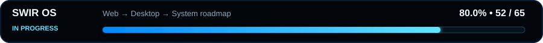

# SWIR Roadmap Standard v1

This document defines the default roadmap format for current and future SWIR projects.

## Presentation amendment — 2026-09-18

The user requires the approved SWIR Progress SVG PRO visuals instead of the old character-based progress meters. The historical 20-segment ASCII/Unicode bar is retired. This amendment supersedes that part of earlier SWIR ROADMAP STYLE LOCK v1 instructions, while preserving the marker, authoritative checklist, measured scope, numeric table, real CI badge and release/safety gates.

The visual and report-delivery standard is [SWIR Progress SVG PRO](https://github.com/Swir/Swir/blob/main/SWIR-PROGRESS-STANDARD.md). Use SVG plus plain numerical fallback; do not leave the old meter below the new graphic or regenerate it in future runs.

## Required dashboard

Every active project must have a roadmap containing one protected progress block. The following is a template for a roadmap at the repository root; replace placeholder values with verified data and adjust relative paths before publishing:

```md
<!-- SWIR-ROADMAP-STANDARD:v1 -->
<!-- ROADMAP-PROGRESS:START -->
<p align="center">
  <a href="CI_WORKFLOW_URL"></a>
  
  
  
</p>

## 📊 Overall progress

<p align="center">
  
</p>

| ✅ Completed | ⏳ Remaining | 📦 Total | 🎯 Progress |
|---:|---:|---:|---:|
| **DONE** | **LEFT** | **TOTAL** | **PERCENT%** |

> **Progress rule:** calculate progress from explicit roadmap deliverables only: `[x] / ([x] + [ ])`. Update the checklist first, then badges, numbers, percentage and SVG geometry from the same verified source. Never estimate progress from version numbers, commit count, elapsed time or activity.
<!-- ROADMAP-PROGRESS:END -->
```

For a roadmap in `docs/` or `Docs/`, use `../assets/readme/progress-mini.svg`; use the appropriate subproject-relative path in multi-project repositories. Keep the SVG and ordinary numeric table readable without duplicated ASCII/Unicode meters. An unavailable graphic must be reported with plain numbers and a concrete blocker, not replaced with a character-art bar.

## Calculation rules

- `[x]` means implemented and verified, not merely started.
- `[ ]` means incomplete, blocked, planned or not yet verified.
- `progress = completed / total * 100` for the explicitly scoped unweighted checklist.
- Compute SVG fill width from the unrounded fraction: `track_width * completed / total`. Text, accessible description, badge values, table and SVG must agree.
- Round displayed percentage to one decimal place unless the project has a stronger domain-specific reason; do not round incomplete work up to 100.0%.
- An empty or unverified denominator is N/A, not 0% or 100%.
- Preserve an existing documented weighted calculation and label its scope; do not silently substitute a raw checkbox percentage.
- At verified 100% for the named scope, the status badge may be `COMPLETE`; before 100%, keep an appropriate in-progress or blocked status. A complete milestone does not automatically imply release readiness or task shutdown.
- If major scope is added, add it as unchecked deliverables first so the denominator remains honest.

## Style lock for automated development

Hourly or recurring project agents must preserve the dashboard's structural markers and data contract. They may update:

- checklist state and scope,
- completed / remaining / total values,
- percentage,
- SVG output and correct relative embedding,
- ROADMAP / DONE / STATUS badge values,
- CI badge target only if the authoritative workflow changes.

The 2026-09-18 amendment explicitly authorizes removing legacy character meters and their otherwise-empty code fences while adding or preserving the SVG and numeric fallback. Do not restore a retired text bar to satisfy an old style-lock prompt. Update the documentation generator/template and presentation assertions so later runs do not recreate it. Retain all mathematical, SVG, release and safety checks; do not bypass failing CI or remove tests wholesale.

Do not remove the numeric table, move the progress block away from the top of the roadmap, drop the real CI badge, change verified checklist evidence for cosmetic reasons or claim progress from subjective estimates. Preserve useful code examples and directory trees; they are not progress meters. Raw historical logs, released artifacts, published tags and archived milestone evidence are not cleanup targets.

## Missing-roadmap rule

An active project without a Roadmap is considered structurally incomplete. Before substantial implementation continues, create its Roadmap using SWIR Roadmap Standard v1 with the current SVG-only presentation amendment.

If an automated development process discovers an active project directory with no Roadmap, it must create the Roadmap first instead of continuing for another hour without progress tracking. A documentation-only migration of a legacy utility must not invent a product scope or readiness score; show N/A until a trustworthy scope exists.

## Single-project repositories

A repository containing one product/game normally uses one authoritative project Roadmap, typically `ROADMAP.md` or the repository's established roadmap path.

That Roadmap owns the product's 0–100% state for its explicitly declared scope.

## Multi-project / multi-game repositories

Repositories containing multiple independent projects or games must use **two levels** of Roadmap:

1. **Master Roadmap** — repository-level queue/index of projects.
2. **Project Roadmap** — one independent 0–100% Roadmap inside every active project directory.

Example:

```text
repo/
  docs/ROADMAP.md                 <- Master Roadmap
  projects/
    002_game_a/
      README.md
      ROADMAP.md                  <- Game A: own 0–100%
    003_game_b/
      README.md
      ROADMAP.md                  <- Game B: own 0–100%
```

The Master Roadmap must not merge all internal tasks from all projects into one giant percentage. Instead it should:

- keep the ordered project/game queue,
- permanently record completed projects at 100%,
- identify the current active project,
- mirror the current project's own percentage/dashboard,
- advance to the next project only after the current project has reached verified 100% or has been explicitly archived/cancelled.

Completed projects keep their 100% state permanently. Starting a new project does not reduce a previously completed project's percentage.

## New-project rule

For every new SWIR project, create a Roadmap at project start using this standard before long-running autonomous development begins. If the project has CI, show the real workflow badge. If CI does not exist yet, omit only the CI badge until a real workflow is added; keep the verified numeric dashboard and SVG requirement.

For multi-project repositories, also add the new project to the Master Roadmap queue before or together with implementation work.
